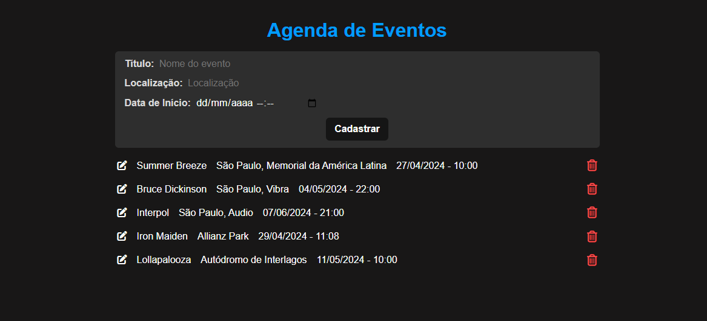

# <center>Agenda de Eventos</center>

<p align="center">
   
</p>

<div align="center">

  [Português](#pt) / [English](#en)

</div>


## 📝 Índice <a name = "pt"></a>

- [Sobre](#about_pt)
- [Linguagens e Ferramentas](#frameworks_pt)
- [Aprendizados](#learnings_pt)
- [Como executar localmente?](#running_pt)

## 🎯 Sobre <a name = "about_pt"></a>

- Cadastro de Agenda de Eventos permitindo edição e exclusão utilizando AngularJS no frontend e Node.js/Express no backend com ORM Prisma.

- Utilizado a recurso Static Public do Express para desenvolvimento do frontend e body-parser como middleware nas chamadas à API.

## ⚒ Linguagens e Ferramentas <a name = "frameworks_pt"></a>

- [HTML](https://developer.mozilla.org/pt-BR/docs/Web/HTML)
- [CSS](https://developer.mozilla.org/pt-BR/docs/Web/CSS)
- [AngularJS](https://angularjs.org/)
- [Node.js](https://nodejs.org/)
- [Express](https://expressjs.com/)
- [Prisma](https://prisma.io/)
- [SQLite](https://www.sqlite.org/)
- [Font Awesome Icon](https://fontawesome.com/search?o=r&m=free)

## 💡 Aprendizados <a name = "learnings_pt"></a>

- Desenvolvimento do Frontend com o AngularJS
- Desenvolvimento de uma API
- Modelagem de base dados com ORM Prisma
- Static Public do Express para desenvolvimento do frontend em conjunto com o backend (`app.use(express.static('public'))`)
- Biblioteca body-parser que serve como um middleware do backend para analisar as informações do body enviadas do frontend para backend.
- Diversas linhas de comandos utilizadas no decorrer do desenvolvimento, [**confira documentação aqui**](.github/docs/COMMAND-LINES.md)

## 🖥️ Como executar localmente? <a name = "running_pt"></a>

Clone o projeto:

```
git clone https://github.com/bernard-silva/backend-agenda-eventos.git
```

Instala conforme o que estiver declarado no package.json:
```
npm install
```

`Obervação:` criar um arquivo .env na raiz para uso do SQLite como dev:
```
DATABASE_URL="file:./dev.db"
```

Cria o schema para base de dados conforme arquivo .env:
```
npx prisma migrate dev
```

Roda o projeto:
```
npm run dev
```


## English

## 📝 Index <a name = "en"></a>

- [About](#about_en)
- [Languages and Tools](#frameworks_en)
- [Learnings](#learnings_en)
- [How to run locally?](#running_en)

## 🎯 About <a name = "about_en"></a>

- Registration of Event Calendar allowing editing and deletion using AngularJS on the frontend and Node.js/Express on the backend with ORM Prisma.

- Used the Static Public feature of Express to develop the frontend and body-parser as middleware in API calls.

## ⚒ Languages and Tools <a name = "frameworks_en"></a>

- [HTML](https://developer.mozilla.org/en-US/docs/Web/HTML)
- [CSS](https://developer.mozilla.org/en-US/docs/Web/CSS)
- [AngularJS](https://angularjs.org/)
- [Node.js](https://nodejs.org/)
- [Express](https://expressjs.com/)
- [Prisma](https://prisma.io/)
- [SQLite](https://www.sqlite.org/)
- [Font Awesome Icon](https://fontawesome.com/search?o=r&m=free)

## 💡 Learnings <a name = "learnings_en"></a>

- Frontend development with AngularJS
- Development of an API
- Database modeling with ORM Prisma
- Express Static Public for frontend development in conjunction with the backend (`app.use(express.static('public'))`)
- Body-parser library that serves as a backend middleware to parse body information sent from the frontend to the backend.
- Several command lines used during development, [**check documentation here**](.github/docs/COMMAND-LINES-en-US.md)

## 🖥️ How to run locally? <a name = "running_en"></a>

Clone the project:

```
git clone https://github.com/bernard-silva/backend-agenda-eventos.git
```

Installs according to what is declared in package.json:
```
npm install
```

`Note:` create a .env file in the root for SQLite use as dev:
```
DATABASE_URL="file:./dev.db"
```

Create the schema for the database according to the .env file:
```
npx prisma migrate dev
```

Run the project:
```
npm run dev
```